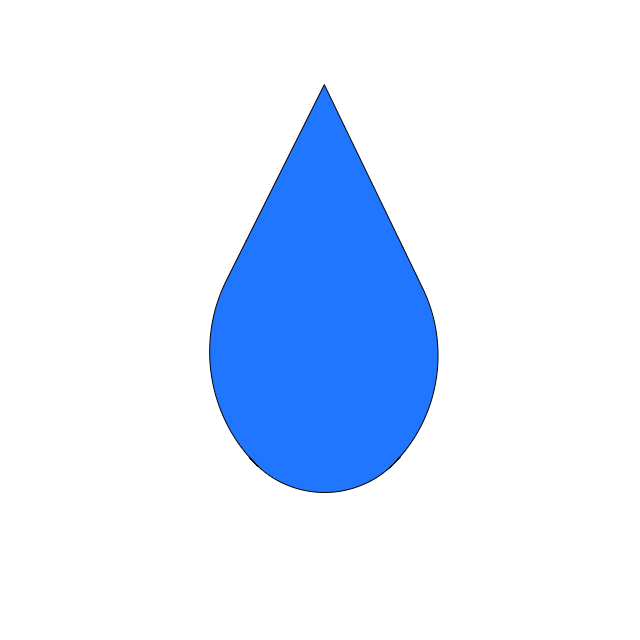
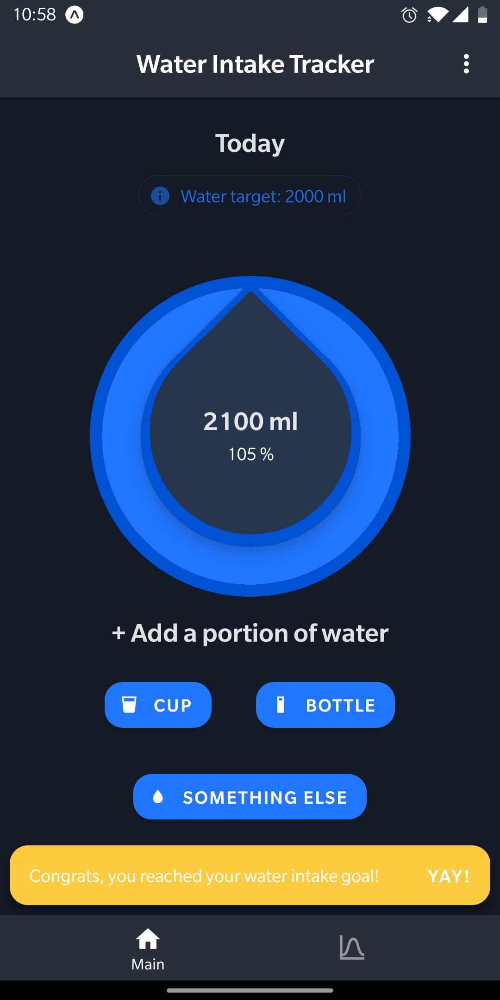
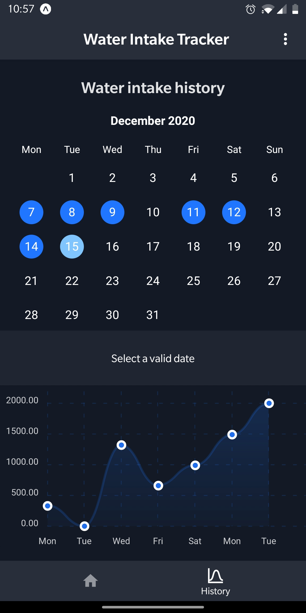
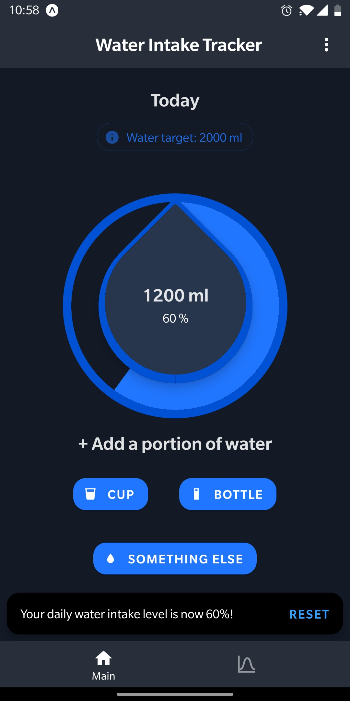
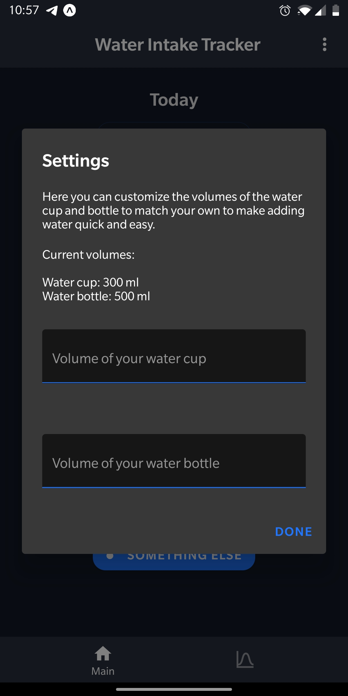

<!-- PROJECT SHIELDS -->
<!--
*** I'm using markdown "reference style" links for readability.
*** Reference links are enclosed in brackets [ ] instead of parentheses ( ).
*** See the bottom of this document for the declaration of the reference variables
*** for contributors-url, forks-url, etc. This is an optional, concise syntax you may use.
*** https://www.markdownguide.org/basic-syntax/#reference-style-links
-->

<!-- PROJECT LOGO -->
 

  

  <h3 align="center">Water tracker</h3>

  

    A React Native app to track daily water intake.
     
    <a href="https://github.com/vyseclown/water-tracker/issues">Report Bug</a>
    ·
    <a href="https://github.com/vyseclown/water-tracker/issues">Request Feature</a>
  

<!-- TABLE OF CONTENTS -->

<!-- ABOUT THE PROJECT -->
## About The Project

An app to track daily water intake made using [Expo](https://expo.io/), [React Native](https://reactnative.dev/) and [Firebase Realtime Database](https://firebase.google.com/docs/database).

   

### Built With

* [Expo](https://expo.io/)
* [React Native](https://reactnative.dev/)
* [Firebase Realtime Database](https://firebase.google.com/docs/database)
* [React Native Paper](https://callstack.github.io/react-native-paper/)
* [react-native-circular-progress](https://github.com/bartgryszko/react-native-circular-progress)
* [react-native-calendars](https://github.com/wix/react-native-calendars)

<!-- USAGE EXAMPLES -->
## Usage

On the main screen you have three buttons, one for a cup of water, another for a bottle of water and a third one where you can input any amount of water you want. The point of these is to make it as quick and easy as possible to track your water intake after drinking ie. a glass of water. You can customize the corresponding volumes of the cup and the bottle to match your own in the settings of the app.

   

<!-- ROADMAP -->
## Roadmap

See the [open issues](https://github.com/vyseclown/water-tracker/issues) for a list of proposed features (and known issues).

<!-- CONTRIBUTING -->
## Contributing

Contributions are what make the open source community such an amazing place to be learn, inspire, and create. Any contributions you make are **greatly appreciated**.

1. Fork the Project
2. Create your Feature Branch (`git checkout -b feature/AmazingFeature`)
3. Commit your Changes (`git commit -m 'Add some AmazingFeature'`)
4. Push to the Branch (`git push origin feature/AmazingFeature`)
5. Open a Pull Request

<!-- LICENSE -->
## License

Distributed under the MIT License. See `LICENSE` for more information.

<!-- CONTACT -->
## Contact

Alessandro Gentil - [LinkedIn](https://www.linkedin.com/in/alessandrogentil/)
